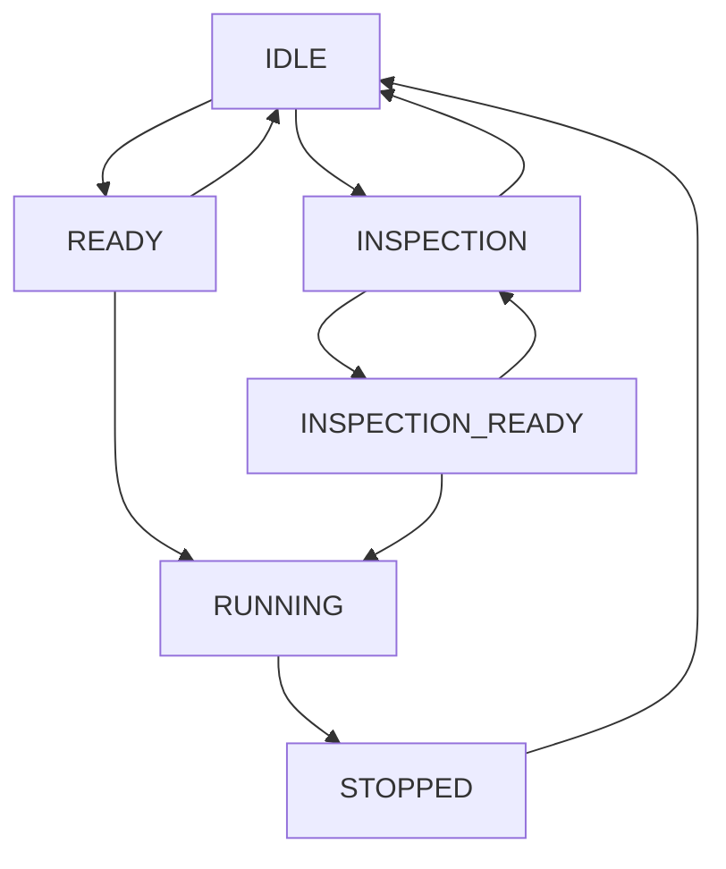

# Timer System Documentation

The timer system is the core of CraftyCubing, providing precise timing functionality for both full solve practice and individual case practice. This document covers the architecture, implementation details, and usage patterns.

## 🎯 Overview

CraftyCubing implements two distinct timer components:
- **Timer.tsx**: Full-featured timer for complete solve practice
- **CaseTimer.tsx**: Simplified timer for algorithm practice

Both timers share common principles but are optimized for their specific use cases.

## ⏱️ Timer.tsx - Main Timer Component

### Core Features
- **Inspection Time**: 8s, 15s, or 30s inspection periods
- **Precise Timing**: Centisecond accuracy using `Date.now()`
- **Visual Feedback**: Color-coded states with full-screen overlays
- **Multi-Input Support**: Keyboard (spacebar) and touch controls
- **Settings Integration**: Configurable inspection time and toggle

### Timer States

```typescript
enum TimerState {
  IDLE = "idle",                    // Ready to start
  READY = "ready",                  // Holding spacebar/touch
  INSPECTION = "inspection",        // 15s countdown
  INSPECTION_READY = "inspection_ready", // Ready to start after inspection
  RUNNING = "running",              // Timer active
  STOPPED = "stopped"               // Timer stopped, showing result
}
```

### State Transitions



### Visual States

| State | Background | Display | Instructions |
|-------|------------|---------|--------------|
| IDLE | Gray | Last time | "Tap to start inspection" |
| READY | Red | "0.00" | "Hold for 0.25s..." |
| INSPECTION | Yellow | Countdown | "Hold for 0.25s to start timer" |
| INSPECTION_READY | Red | "0.00" | "Hold for 0.25s..." |
| RUNNING | Green | Live time | "Tap anywhere to stop • Esc to cancel" |
| STOPPED | Blue | Final time | "Tap to start next solve" |

### Control Mechanisms

#### Keyboard Controls
```typescript
// Spacebar handling
if (e.code === "Space" && !e.repeat) {
  e.preventDefault();
  e.stopPropagation();
  handleTouchStart();
}

// Escape key (cancel)
if (e.code === "Escape") {
  e.preventDefault();
  if (timerState === TimerState.RUNNING) {
    cancelTimer(); // No solve recorded
  }
}
```

#### Touch Controls
```typescript
// Touch event handling with exclusions
const handleTimerAreaTouchStart = useCallback((e: React.TouchEvent) => {
  const target = e.target as HTMLElement;
  const isExcludedButton = target.closest('[data-timer-exclude]');
  
  if (isExcludedButton) return; // Don't trigger timer
  
  e.preventDefault(); // Prevent scrolling
  e.stopPropagation(); // Prevent bubbling
  handleTouchStart();
}, [timerState]);
```

### Timing Implementation

#### Precision Timing
```typescript
const startRunningTimer = () => {
  const start = Date.now();
  setStartTime(start);

  const interval = setInterval(() => {
    const now = Date.now();
    const elapsed = now - start;
    setDisplayTime(formatDisplayTime(elapsed));
  }, 10); // 10ms updates for smooth display

  setTimerInterval(interval);
};
```

#### Time Formatting
```typescript
const formatDisplayTime = (ms: number): string => {
  // Round to centiseconds (2 decimal places)
  const roundedMs = Math.round(ms / 10) * 10;
  const seconds = Math.floor(roundedMs / 1000);
  const milliseconds = Math.floor((roundedMs % 1000) / 10);
  return `${seconds}.${milliseconds.toString().padStart(2, "0")}`;
};
```

### Settings Integration

#### Inspection Configuration
```typescript
// Settings panel
<select
  value={inspectionTime}
  onChange={(e) => handleInspectionTimeChange(Number(e.target.value))}
>
  <option value={8}>8 seconds</option>
  <option value={15}>15 seconds</option>
  <option value={30}>30 seconds</option>
</select>

// Toggle switch
<button
  onClick={handleInspectionToggle}
  className={`toggle ${useInspection ? "active" : ""}`}
>
  Enable Inspection
</button>
```

## 🎯 CaseTimer.tsx - Case Practice Timer

### Simplified Design
The case timer is optimized for rapid practice cycles:
- **No Inspection**: Immediate start capability
- **Compact Display**: Smaller footprint
- **Quick Cycles**: Fast reset and retry
- **Algorithm Focus**: Designed for repetitive practice

### Key Differences from Main Timer

| Feature | Main Timer | Case Timer |
|---------|------------|------------|
| Inspection | Yes (8s/15s/30s) | No |
| Display Size | Full screen | Inline |
| Settings Panel | Yes | No |
| Visual Overlay | Full screen | Text only |
| Use Case | Full solves | Algorithm practice |

### Implementation
```typescript
// Simplified state machine
enum TimerState {
  IDLE = "idle",
  READY = "ready", 
  RUNNING = "running",
  STOPPED = "stopped"
}

// Direct timer interaction
<div 
  className={getTimerClasses()}
  onTouchStart={handleTimerTouchStart}
  onTouchEnd={handleTimerTouchEnd}
  style={{ touchAction: 'none' }}
>
  {displayTime}s
</div>
```

## 🎮 Input Handling Architecture

### Event Capture Strategy
Both timers use event capture to ensure reliable input handling:

```typescript
// Global event listeners with capture
window.addEventListener("keydown", handleKeyDown, true);
window.addEventListener("keyup", handleKeyUp, true);

// Cleanup
return () => {
  window.removeEventListener("keydown", handleKeyDown, true);
  window.removeEventListener("keyup", handleKeyUp, true);
};
```

### Mobile Optimizations

#### Touch Action Prevention
```typescript
// Prevent default touch behaviors
style={{ touchAction: 'none' }}

// Event prevention
e.preventDefault(); // Stop scrolling
e.stopPropagation(); // Stop bubbling
```

#### Scroll Detection
```typescript
// Training page scroll detection
const isScrollingRef = useRef(false);

useEffect(() => {
  const handleScroll = () => {
    isScrollingRef.current = true;
    setTimeout(() => {
      isScrollingRef.current = false;
    }, 150);
  };

  window.addEventListener('scroll', handleScroll, { passive: true });
}, []);
```

### Button Exclusions
Settings buttons are excluded from timer events:

```typescript
// Mark buttons as excluded
<button data-timer-exclude="true">
  <Settings />
</button>

// Check for exclusions
const isExcludedButton = target.closest('[data-timer-exclude]');
if (isExcludedButton) return;
```

## 📊 Integration with Statistics

### Solve Completion
```typescript
const handleSolveComplete = async (time: number) => {
  // Round to centiseconds
  const roundedTime = Math.round(time / 10) * 10;
  
  // Save to database
  await db.solves.add({
    sessionId: currentSession.id,
    time: roundedTime,
    scramble: currentScramble,
    date: new Date()
  });
  
  // Trigger statistics recalculation
  onComplete(roundedTime);
};
```

### Personal Best Detection
```typescript
// Check for new records after solve completion
useEffect(() => {
  if (justAddedSolve && currentStats.bestSingle < previousBest) {
    showConfetti();
    savePersonalBest('single', currentStats.bestSingle);
  }
}, [currentStats, justAddedSolve]);
```

## 🔧 Performance Considerations

### Memory Management
```typescript
useEffect(() => {
  return () => {
    // Cleanup intervals
    if (timerInterval) clearInterval(timerInterval);
    if (holdTimeoutRef.current) clearTimeout(holdTimeoutRef.current);
    
    // Remove event listeners
    window.removeEventListener("keydown", handleKeyDown, true);
    window.removeEventListener("keyup", handleKeyUp, true);
  };
}, []);
```

### Efficient Updates
```typescript
// Use refs for performance-critical state
const isHoldingRef = useRef(false);
const holdTimeoutRef = useRef<NodeJS.Timeout | null>(null);

// Minimize re-renders with useCallback
const handleKeyDown = useCallback((e: KeyboardEvent) => {
  // Handler logic
}, [timerState, useInspection]);
```

## 🚀 Usage Examples

### Basic Timer Integration
```typescript
<Timer
  onComplete={handleSolveComplete}
  inspectionTime={15}
  useInspection={true}
  onTimerStateChange={(state) => setShowScramble(state === 'idle')}
/>
```

### Case Timer Integration
```typescript
<CaseTimer
  caseId="F2L-1"
  onComplete={(time) => recordAlgorithmTime(algorithmId, time)}
/>
```

### Session-Specific Settings
```typescript
const { useInspection, inspectionTime } = getInspectionSettings();

<Timer
  key={`timer-${sessionId}-${useInspection}-${inspectionTime}`}
  useInspection={useInspection}
  inspectionTime={inspectionTime}
  onInspectionToggle={updateSessionSettings}
/>
```

## 🔮 Future Enhancements

### Planned Features
- **Voice Commands**: "Ready", "Go" voice prompts
- **Haptic Feedback**: Vibration on mobile devices
- **Custom Hold Times**: User-configurable hold duration
- **Advanced Timing**: Stackmat timer integration

### Performance Improvements
- **Web Workers**: Background timing calculations
- **High-Resolution Timing**: Performance.now() for sub-millisecond accuracy
- **Predictive Loading**: Pre-calculate next scramble

### Accessibility
- **Screen Reader Support**: ARIA labels and announcements
- **Keyboard Navigation**: Full keyboard accessibility
- **High Contrast**: Visual accessibility improvements
- **Reduced Motion**: Respect user motion preferences

---

The timer system provides the foundation for all timing functionality in CraftyCubing, balancing precision, usability, and performance across different use cases and devices.